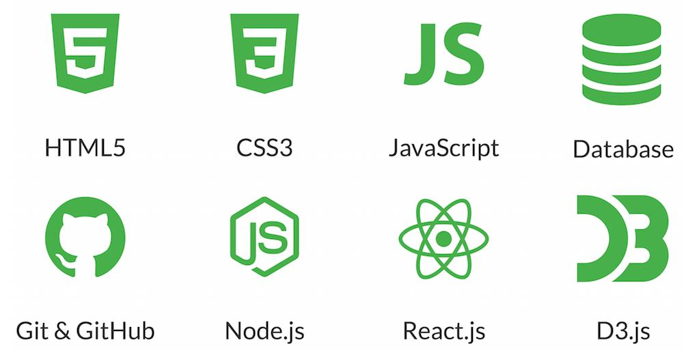
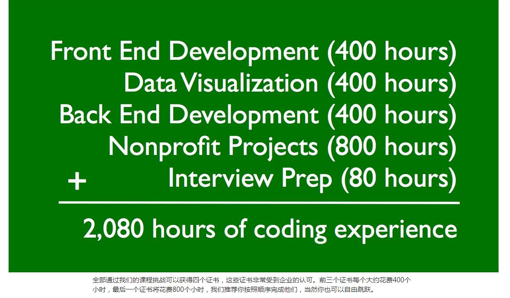
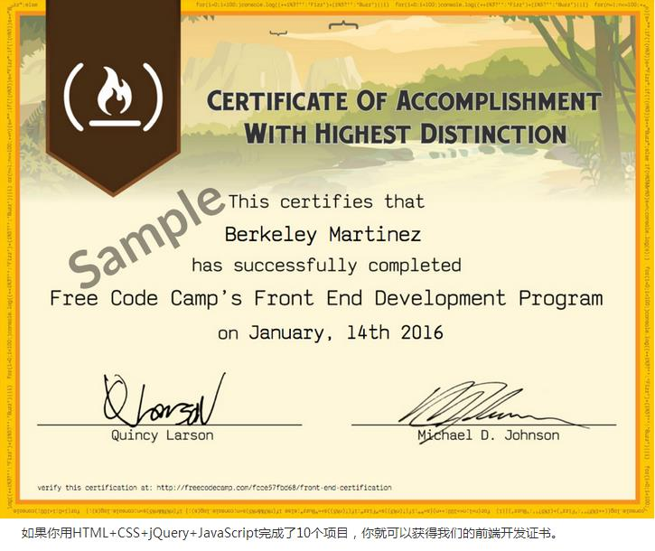
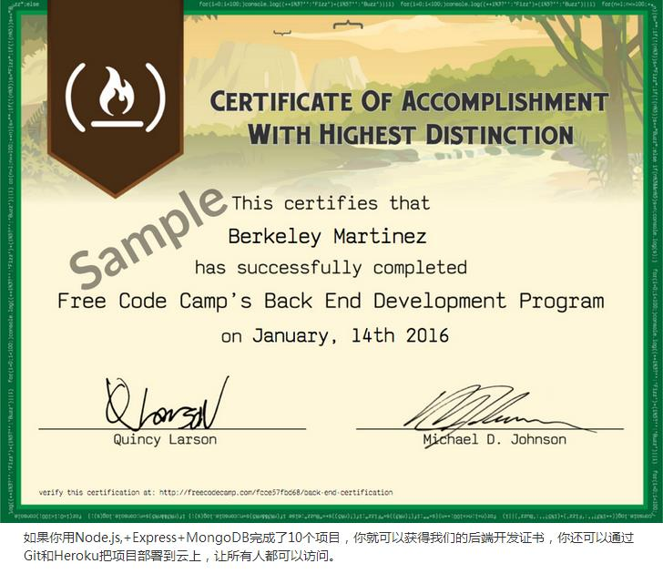

 
 
 
 
 
<h1>2017年5月26日</h1>

h2标题有副标题的说法； 
border-radius:50%,是一个圆； 
input元素是自关闭的; 
<input type="text"/> 
<input type="text" placeholder="this is placeholder text">占位符 
<strong>Bootstrap</strong>
<h2>稍后解决的关口</h2>
<ul>
<li><a href="https://codepen.io/freeCodeCamp/full/YqLyXB/">Build a Personal Portfolio Webpage</a></li>
<li><a href="#">弹幕墙</a> 

关于弹幕墙的思考：这个有一个思路是视频弹幕、html5视频弹幕的实现、视频弹幕的实现

</li>
<li><a href="https://github.com/WildDogTeam/demo-js-danmu">弹幕墙的示例（这个示例地址中可以拓展到其他地方）</a></li>
</ul>

<h2>学习到：Comparison with the Equality Operator</h2>
<h1>2017年5月27日</h1>

